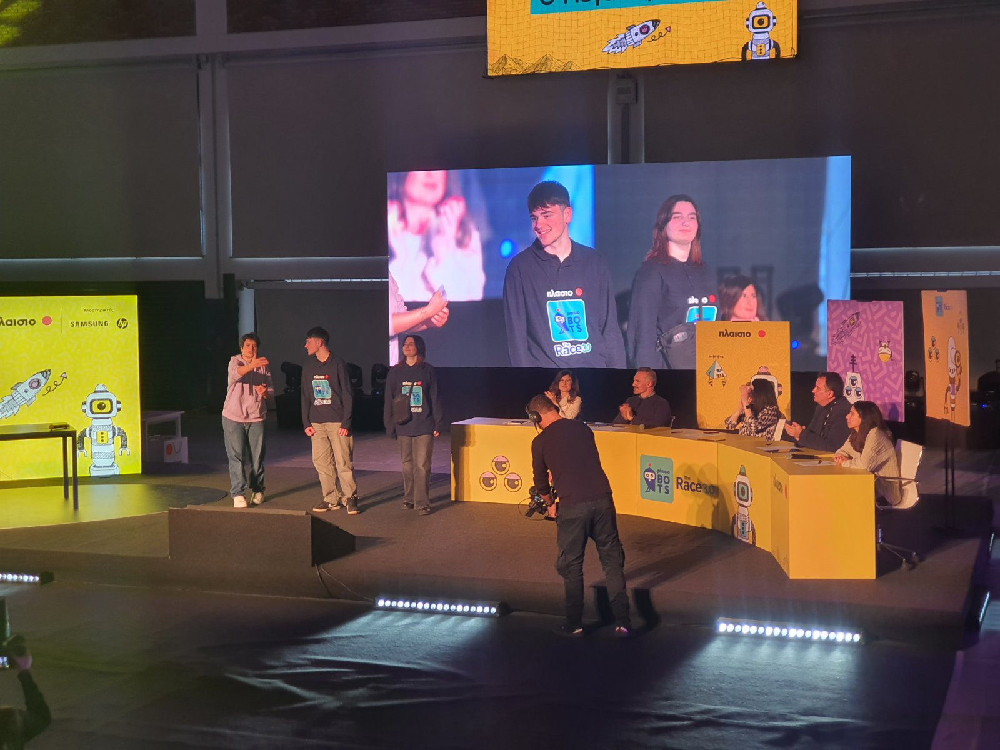
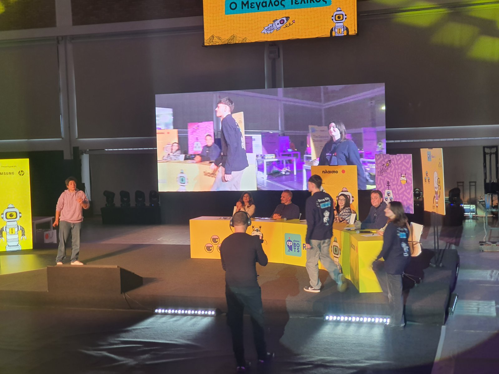
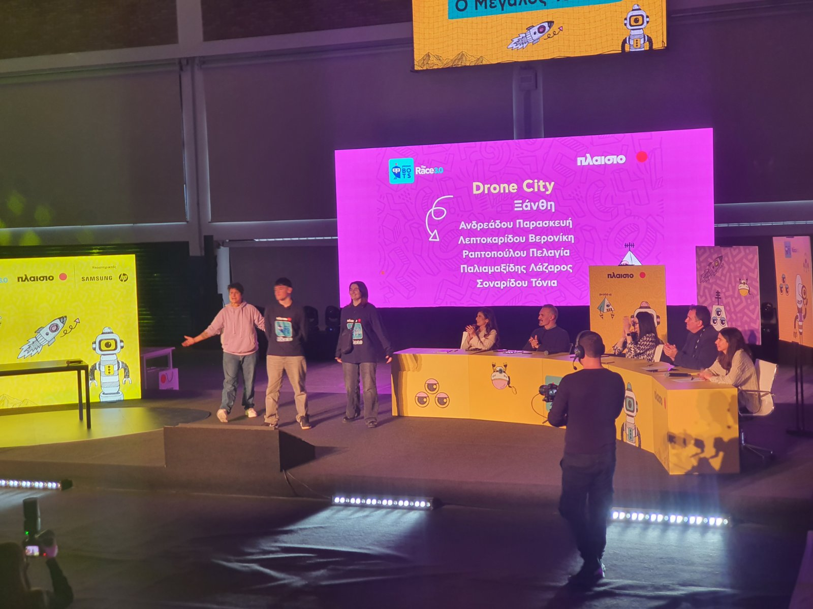

# DRONE-CITY


©lazpal2025 #DRONE-CITY/LICENSE
<table align="center">
  <tr>
    <td align="center">
      
    </td>
    <td align="center">
      
    </td>
  </tr>
   <tr>
    <td align="center">
      
    </td>
    <td align="center">
      
    </td>
  </tr>
   <tr>
    <td align="center">
      
    </td>
    <td align="center">
      
    </td>
  </tr>
  <tr>
    <td align="center">
      
    </td>
    <td align="center">
      
    </td>
  </tr>
  <tr>
    <td align="center">
      
    </td>
    <td align="center">
      
    </td>
  </tr>
</table>

# Περιγραφή Πρότζεκτ
<b> Real-Time Data Monitoring API :</b><br>
Αυτό το project αναπτύχθηκε για να παρέχει δεδομένα αισθητήρων σε πραγματικό χρόνο από ένα Arduino και να τα παρουσιάζει σε διάφορες μορφές HTML rendering.

# Ο διαγωνισμός που συμμετείχε το project
<a href="https://www.plaisio.gr/Campaign/Plaisiobots/the-race-3"></a>
<a href="https://www.plaisio.gr/Campaign/Plaisiobots/the-race-3">PlaisioBots The Race 3.0</a>

# WEBSITE
  https://lazpal.github.io/DRONE-CITY/website/
  - https://lazpal.github.io/DRONE-CITY/website/me.html
  - https://lazpal.github.io/DRONE-CITY/website/mobile.html
  - https://lazpal.github.io/DRONE-CITY/website/index.html
  - https://lazpal.github.io/DRONE-CITY/website/info.html
  - https://lazpal.github.io/DRONE-CITY/website/infovoc.html
  - https://lazpal.github.io/DRONE-CITY/website/logs.html
  - https://lazpal.github.io/DRONE-CITY/website/test.html


# CASE on 3D cad
https://cdn.glitch.global/1b0e4ef2-383c-4c1c-848c-a26e5fad7097/DRONE%20CITY%20CASE%20V9%20LAST_kapaki%20v2.3mf?v=1735068719473
<br>
https://cdn.glitch.global/1b0e4ef2-383c-4c1c-848c-a26e5fad7097/DRONE%20CITY%20CASE%20V9%20LAST_main%20Body%20v2.3mf?v=1735068730082


<hr>

## Σύνδεσμοι

# Business Plan DRONE CITY     
https://www.canva.com/design/DAGVt87-BB4/bTucy8LhuNCnH3ldCIeSRg/edit?utm_content=DAGVt87-BB4&utm_campaign=designshare&utm_medium=link2&utm_source=sharebutton

# DRONE CITY WIRE TUTORIAL
https://www.canva.com/design/DAGaOqh2x0Y/BcYAMi1m4aCvphYfd3TMWg/edit?utm_content=DAGaOqh2x0Y&utm_campaign=designshare&utm_medium=link2&utm_source=sharebutton

# Android APP (APK)
https://drive.usercontent.google.com/download?id=1AdrvETzRNtrS2hXJykAjjGW3sVNY7A8F&export=download&authuser=0


# Οδηγίες Εγκατάστασης
## DRONE CITY WIRE TUTORIAL
https://www.canva.com/design/DAGaOqh2x0Y/BcYAMi1m4aCvphYfd3TMWg/edit?utm_content=DAGaOqh2x0Y&utm_campaign=designshare&utm_medium=link2&utm_source=sharebutton

## API
  https://drone-city-api.glitch.me/

## API Endpoints
- **GET /data**: Ανάκτηση δεδομένων αισθητήρων.
- **POST /data**: Αποστολή δεδομένων αισθητήρων.
- **GET /html-data**: Δυναμική σελίδα HTML με τα τρέχοντα δεδομένα.
- **GET /test**: 
- **POST /test-form**: 
- **POST /restart**: 
<hr>

-----------------

## Εικόνες 


##
author 'lazpal'
----
©lazpal2025

```
